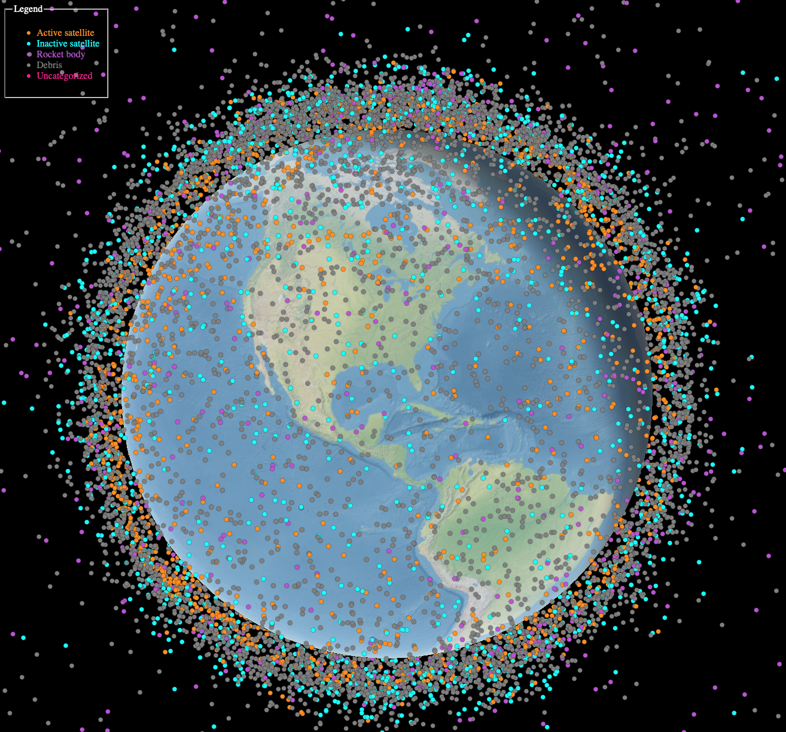
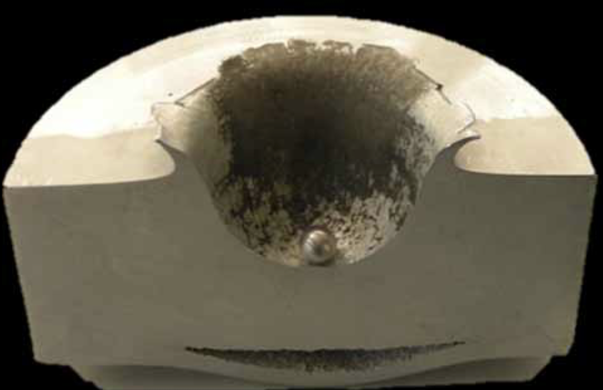
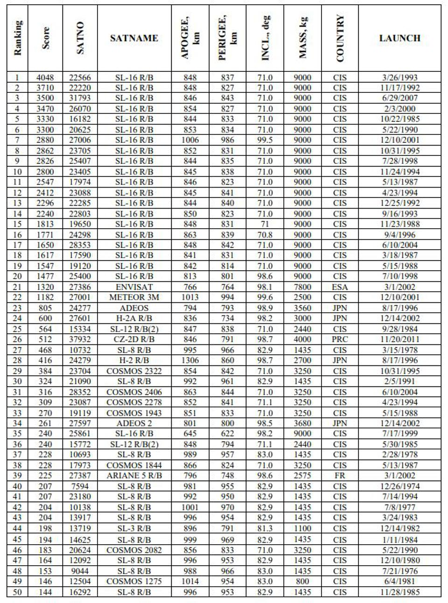

# The Problem with Space Debris

On [September 22, 2020 at 5:19 PM EDT](https://blogs.nasa.gov/spacestation/2020/09/22/station-boosts-orbit-to-avoid-space-debris/) the astronauts aboard the International Space Station (ISS) fired the station's propulsion system for 150 seconds then they made their way to their [Soyuz MS-16 spacecraft](https://en.wikipedia.org/wiki/Soyuz_MS-16) in case they needed to make a last minute escape. The reason for the unplanned maneuver and the crew heading for the exits? A [piece of debris](https://spacenews.com/space-station-maneuvers-to-avoid-debris/) from a Japanese [H-2A](https://en.wikipedia.org/wiki/H-IIA) rocket body that launched in 2008 was predicted at the last minute to come within 1.39 kilometers of the ISS.  *Objects in LEO ([Image Source](https://astriagraph.spacetech-ibm.com))*

The [U.S. military currently tracks](https://www.space-track.org/auth/login) around 15,000 anthropogenic space objects (ASOs) in low Earth orbit (LEO), which are objects that have an altitude between 300 - 2,000 km. These objects range in size from about a softball to the ISS and travel at speeds between 7-8 kilometers per second. Unfortunately we cannot reliably track objects smaller than 5-10 cm and there are an estimated 400,000 - 500,000 of those. While objects smaller than 5 cm might not sound too dangerous we need to remember that they are traveling at a rate 10 times faster than a bullet as we can see from the results of firing a 1 cm diameter aluminum sphere into a solid block of aluminum 8 cm thick.  *[Image Source](https://swfound.org/media/99971/wright-space-debris_situation.pdf)*

# The 50 Most Dangerous ASOs

A group of 11 teams of international researchers has recently been working to determine what are the most dangerous ASOs currently in Earth's orbit. Their determination is based on the likelihood the objects will collide with other objects thus spawning more space debris and possibly more collisions.  *50 Most Dangerous ASOs [Image Source](https://www.forbes.com/sites/jonathanocallaghan/2020/09/10/experts-reveal-the-50-most-dangerous-pieces-of-space-junk-orbiting-earth-right-now/#61f7c0397c21)*

Will any of these objects come close to the ISS in the coming days? We can use the [orbit prediction](https://github.com/IBM/spacetech-ssa/tree/master/orbit_prediction) and [conjunction search](https://github.com/IBM/spacetech-ssa/tree/master/conjunction_search) components of the [space situational awareness](https://github.com/IBM/spacetech-ssa) project to find out.

# Predicting where Space Objects will be in the Future

For objects we can track we still have the problem of determining where they will be in the future so we can take corrective action if need be. State-of-the-art methods for orbit prediction rely on physics-based models, which to be successful, require extremely accurate data of the ASO and the environment in which it operates. The trouble is, the location data we get about ASOs from terrestrial based sensors comes infrequently and is noisy and our understanding of phenomena like space weather and atmospheric density are in their nascent stages. Our approach is to improve orbit prediction using machine learning methods, not by using ML models to predict orbits, but to create models that learn when physical models get orbit prediction wrong. This methodology allows us to take advantage of the scientific underpinning of the physical models and reduces the search space of machine learning models we have to comb through.  Detailed instructions on installing all the requisite dependencies and the API/CLI for each component can be found [here](https://github.com/IBM/spacetech-ssa/blob/master/orbit_prediction/README.md) along with a [demo script](https://github.com/IBM/spacetech-ssa/blob/master/orbit_prediction/pipeline_demo.sh) that can run the pipeline end-to-end, but a brief outline of the steps are that we:

1.  ETL historic orbit data from the U.S. military for all the objects they track in LEO.
2.  Use a physics based orbital dynamics model and the historical orbit data to build a training dataset of the physics model's prediction errors.
3.  Train a basic machine learning model to estimate the physics model's prediction errors.
4.  Combine the physics and ML models into one orbit predictor that we use to predict the future location of the ISS and the top 50 most dangerous ASOs for the next 3 days. We do this by utilizing the `--norad_id_file` flag in the `pred_orbits` module and pass a text file that has the NORAD IDs for only the ISS and the dangerous APOs.

# Determining Close Approaches

Now that we have predictions on where the ISS and the top 50 most dangerous APOs are going to be over the next 3 days, we want to be able answer queries like:

-   What are the 10 ASOs that will come the closest to the ISS in the next 3 days?
-   For the same time period, how which ASOs will come within a radius of X to the ISS?

The conjunction (a fancy word for "close approach") search [service](https://github.com/IBM/spacetech-ssa/tree/master/conjunction_search) can answer just these kinds of questions for us. A demo that offers a UI and interactive 3-dimensional visualization of the results can be found [here](https://spaceorbits.net).
