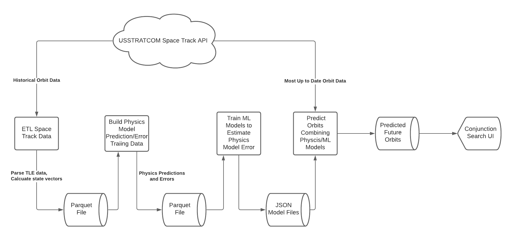

# Predicting Errors in Satellite Orbits with Watson Studio

Low earth orbit (LEO) is a crowded place and the number of anthropogenic space objects (ASOs) entering LEO is rapidly escalating. With this population boom also comes the inevitable increase in close encounters (conjunctions) between objects. The heart of the space situational awareness (SSA) problem is to predict where ASOs are now and where they are going to be in the future. This includes objects from the size of a spec of paint to the International Space Station. In this Code Pattern we utilize [Watson Studio](https://www.ibm.com/cloud/watson-studio) and IBM's [Space Situational Awareness](https://github.com/ibm/spacetech-ssa) project to use machine learning techniques to estimate the error in physics-based astrodynamical models of the orbits of satellites in LEO.

## Flow

## Included Technologies

-   [Watson Studio](https://www.ibm.com/cloud/watson-studio) for running the notebook.
-   [TLE-tools](https://pypi.org/project/TLE-tools/) for working with [two-line element set](https://en.wikipedia.org/wiki/Two-line_element_set) data.
-   [Spacetrack](https://pypi.org/project/spacetrack/) for downloading TLE data from <https://www.space-track.org>.
-   [Astropy](https://pypi.org/project/astropy/) for astrophysics unit conversions.
-   [Poliaastro](https://pypi.org/project/poliastro/) for orbital mechanics models.
-   [XGBoost](https://xgboost.ai) for building gradient boosted regression tree error estimation models.

## Prerequisites

-   An IBM Cloud account to access [Watson Studio](https://www.ibm.com/cloud/watson-studio)
-   A [Space-Track.org](https://www.space-track.org) account for access to historic satellite orbit data.

## Steps

The [notebook](file:///Users/colin/projects/spacetech-ssa/orbit_prediction/code_pattern/ssa_notebook.ipynb) is all you need to run the demo. If you are familiar with Watson Studio and how to import an existing notebook, you can skip this part and simply import the notebook into any project you have and just run it.

Follow below steps if you are not familiar with Watson Studio:

1.  Sign up [here](https://dataplatform.cloud.ibm.com/) for Watson Studio
2.  [Create a notebook](https://dataplatform.cloud.ibm.com/docs/content/wsj/analyze-data/creating-notebooks.html) with this template. You can either download the notebook and import it using `From file` tab or get the raw github link of the notebook and import it using the `From URL` tab.
3.  Run the notebook cell by cell.

## License

This code pattern is licensed under the Apache Software License, Version 2. Separate third party code objects invoked within this code pattern are licensed by their respective providers pursuant to their own separate licenses. Contributions are subject to the [Developer Certificate of Origin, Version 1.1 (DCO)](https://developercertificate.org/) and the [Apache Software License, Version 2](https://www.apache.org/licenses/LICENSE-2.0.txt).

[Apache Software License (ASL) FAQ](https://www.apache.org/foundation/license-faq.html#WhatDoesItMEAN)
